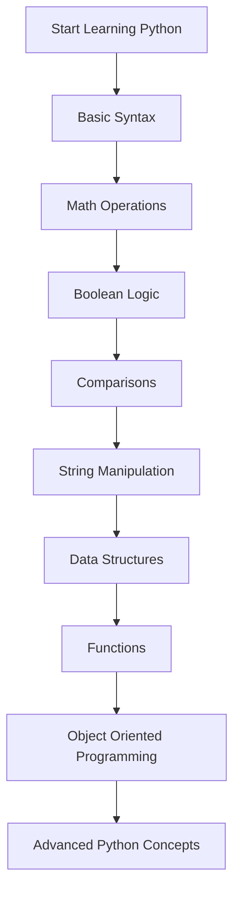

<div align="center">

# 🐍 Learn Python


A beginner-friendly repository designed to help anyone **learn Python programming from scratch through clear explanations and practical examples**.

</div>

---

# 📑 Table of Contents

* Overview
* Project Objective
* Tools Used
* Libraries Used
* How It Works — Step-by-step
* Workflow
* Key Concepts
* What I Learned
* Through this project I also gained insight into
* Project Structure
* How to Run the Project
* Future Improvements
* Author
* License

---

# 📘 Overview

Python is one of the most popular programming languages in the world. It is widely used in:

* Software Development
* Data Science
* Machine Learning
* Web Development
* Automation

This repository was created to provide a **clear and structured path for beginners to learn Python programming**.

Instead of only reading theory, the repository focuses on:

• **Practical code examples**
• **Step-by-step learning**
• **Core programming concepts**

By following this repository, beginners can gradually move from **basic syntax to advanced Python concepts**.

---

# 🎯 Project Objective

The goals of this repository are:

• Help beginners **learn Python from zero**
• Provide **simple explanations of programming concepts**
• Demonstrate concepts using **clean and readable code**
• Build a **strong foundation in Python programming**
• Encourage learning through **practice and experimentation**

---

# 🛠 Tools Used

The following tools were used in this project.

### Python

The primary programming language used to write all examples and exercises.

### Jupyter Notebook / Python Interpreter

Used to test and run Python code interactively.

### Git & GitHub

Used for version control and sharing the repository publicly.

---

# 📚 Libraries Used

This repository mainly focuses on **core Python concepts**, so external libraries are minimal.

However, the following standard Python tools may appear in examples:

### Python Standard Library

Includes built-in modules like:

* `math`
* `random`
* `datetime`
* `sys`

These libraries help demonstrate practical Python programming.

---

# ⚙️ How It Works — Step-by-step

The learning approach used in this repository follows a simple progression.

1. Start with **Python fundamentals** such as comments and variables.
2. Learn **mathematical operations and expressions**.
3. Understand **Boolean values and logical operators**.
4. Practice **comparison operations and conditional thinking**.
5. Work with **strings and text manipulation**.
6. Explore **Python data structures**.
7. Learn how to create **functions**.
8. Understand **object-oriented programming concepts**.
9. Practice using **advanced Python patterns**.

Each step builds on previous knowledge to strengthen understanding.

---

# 🔄 Workflow

Below is the structured learning path used in this repository.



This workflow represents a **progressive learning roadmap** for mastering Python fundamentals.

---

# 🧠 Key Concepts

The repository focuses on important Python programming concepts.

| Concept            | Description                             |
| ------------------ | --------------------------------------- |
| 📝 Comments        | Use `#` and `""" """` for documentation |
| ➗ Math Operations  | `+ - * / // % **` operators             |
| 🔘 Boolean Logic   | `True`, `False`, `and`, `or`, `not`     |
| ⚖️ Comparisons     | `==`, `!=`, `<`, `>`, `<=`, `>=`, `is`  |
| 🧵 Strings         | Formatting, concatenation, indexing     |
| 📦 Data Structures | Lists, tuples, dictionaries, sets       |
| ⚙️ Advanced Python | Generators, functions, classes          |

---

# 🎓 What I Learned

While building this repository, I gained experience in:

• Writing **clean and readable Python code**
• Explaining programming concepts clearly
• Structuring a **learning path for beginners**
• Using GitHub to document programming knowledge
• Organizing educational programming content

---

# 💡 Through this project I also gained insight into

• How beginners approach **learning programming**
• The importance of **clear documentation**
• Structuring repositories for **educational purposes**
• Explaining technical concepts in **simple language**
• Creating resources that help others learn coding

---

# 📁 Project Structure

```
learnPython
│
├── basics.py
├── strings.py
├── data_structures.py
├── functions.py
├── oop.py
├── examples/
└── README.md
```

Description:

• **basics.py** → Python fundamentals
• **strings.py** → String operations and formatting
• **data_structures.py** → Lists, tuples, dictionaries, sets
• **functions.py** → Function definitions and parameters
• **oop.py** → Classes, objects, inheritance
• **examples/** → Practice examples
• **README.md** → Repository documentation

---

# ▶️ How to Run the Project

### Step 1 — Clone the Repository

```bash
git clone https://github.com/yourusername/learnPython.git
```

### Step 2 — Navigate to the Folder

```bash
cd learnPython
```

### Step 3 — Run Python Files

Run any file using Python:

```bash
python basics.py
```

or open in **Jupyter Notebook** for experimentation.

---

# 🚀 Future Improvements

Possible improvements for this repository:

• Add **interactive exercises**
• Include **Python mini-projects**
• Add **visual diagrams for concepts**
• Create **practice challenges**
• Expand into **data science and automation examples**

---

# 👨‍💻 Author


**ft-FiasCode**

GitHub: [https://github.com/ft-FiasCode](https://github.com/ft-FiasCode)

---

# 📜 License

MIT License: 

This project is open-source and free to use, modify, and distribute.


---

<div align="center">

⭐ If you found this project useful, consider **starring the repository**.

</div>
